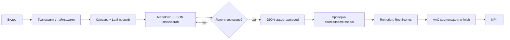

# Архитектура AutoMontage-Agent

Актуально на 2026-08-05. Документ описывает существующий код, а не будущую дорожную карту.

## 1. Назначение и границы

AutoMontage-Agent – локальный конвейер «видео + монтажное решение → MP4». Он объединяет:

- Node.js-оркестратор и CLI;
- faster-whisper для локальной транскрибации;
- Remotion + React для программной графики;
- ffmpeg для подготовки исходника, музыки и финишной обработки;
- OpenCV/Python для анализа лица и перекадрирования;
- JSON-монтажные листы, отделяющие смысл и тайминг от визуальной темы.

Проект не является видеоредактором с GUI, облачным сервисом или хранилищем пользовательских
роликов. Исходники, музыка и результаты живут локально и не входят в репозиторий.

## 2. Главная модель: тема → композиция → монтажный лист

1. **Тема** (`src/theme/`) хранит цвета, шрифты, радиусы, тени и параметры движения.
2. **Композиция** (`src/`, `src/blocks/`, `src/scenes/`) знает, как рисовать и анимировать.
3. **Монтажный лист** (`props/*.json`, `schema/*.json`) определяет, что и когда показать.

Так один сценарий можно отрендерить в другой теме, не переписывая компоненты, а приватный
стиль можно подключить извне через `THEMES_EXT`.

Default зависит от композиции: lesson/ReelScenes использует встроенную
`lesson-neutral`, Dynamic использует `craft`. Оба значения задаются до построения props;
внешний theme id всегда передаётся явно.

## 3. Потоки данных

### 3.1 Dynamic – общий монтаж

```mermaid
flowchart LR
  A["Видео"] --> B["ffprobe: геометрия, FPS, длительность"]
  B --> C["ffmpeg: WAV 16 kHz mono"]
  C --> D["faster-whisper: transcript.json"]
  D --> E["Опционально: tighten / reframe / autopos"]
  E --> F["scenario JSON + captions.js"]
  F --> G["JSON Schema + quality gates"]
  G --> H["Remotion: Dynamic"]
  H --> I["ffmpeg finish / music"]
  I --> J["MP4 в projects/ или legacy out/"]
```

Точка оркестрации – `scripts/build.js`. Без `--scenario` он создаёт черновой монтажный
лист; смысловую расстановку блоков агент затем правит и запускает повторно с готовым JSON.

### 3.2 Lesson – ТЗ до рендера

`scripts/lesson/workflow.js` определяет режим `plan` или `render`.
`scripts/gen-brief.js` выбирает только официальные сцены и создаёт draft.
`scripts/lesson/brief.js` валидирует данные и превращает approved brief в props.
`schema/lesson-brief.schema.json` фиксирует контракт.

Brief замораживает исходник, тему, аспект, размеры, FPS, длительность, сцены и проверенное
кадрирование лица. Это защищает от ситуации, когда утверждали один монтаж, а рендерится другой.

## 4. Remotion-слой

`src/index.js` регистрирует композиции через `src/Root.jsx`.

- `Dynamic` – блоки из scenario: карточки, счётчики, b-roll, CTA и субтитры.
- `ReelScenes` – официальная библиотека lesson-сцен через `SceneDirector`.
- `LessonSeq` и связанные lesson-композиции – ранний слайдовый путь, сохранённый в коде.
- Демо-композиции используют готовые данные из `src/scenario-*.js` и `examples/`.

`SceneDirector.jsx` раскладывает сцены по глобальным таймкодам. Видео внутри каждой сцены
получает `trimBefore`, равный глобальному стартовому кадру; единая аудиодорожка не сбрасывается.

Официальные lesson-сцены находятся в `src/scenes/scenes.jsx`:

| JSON-ключ | Назначение |
|---|---|
| `fullscreen` | спикер на весь экран, короткая подпись |
| `split` | спикер + заголовок и тезисы |
| `bottom-diagram` | последовательность шагов |
| `blur-overlay` | сильный числовой или смысловой акцент |
| `text-only` | крупная цитата без спикера |
| `stat` | реально произнесённая метрика |
| `broll` | визуальный пример из доступного файла |

`chart` реализован как эксперимент, но запрещён в автоматическом lesson-brief.

## 5. Скрипты и ответственность

| Область | Основные файлы |
|---|---|
| Пользовательский CLI | `scripts/cli.js`, `scripts/doctor.js` |
| Оркестрация | `scripts/build.js`, `scripts/env.js` |
| Папки и версии роликов | `scripts/project/workspace.js`, `scripts/project/build-context.js` |
| Транскрипция и субтитры | `scripts/transcribe.py`, `scripts/build-captions.js` |
| Lesson brief | `scripts/gen-brief.js`, `scripts/lesson/*` |
| Валидация и качество | `scripts/validate.js`, `scripts/quality-gate.js`, `scripts/dynamic-gate.js` |
| Монтаж аудио/видео | `scripts/finish.js`, `scripts/finish-audio.js`, `scripts/mix-music.js`, `scripts/pack-tg.js` |
| Длинные рендеры | `scripts/render-chunks.js` |
| Паузы и кадрирование | `scripts/tighten.js`, `scripts/cut-pauses.js`, `scripts/reframe.py`, `scripts/face-center.py` |
| Внешние темы | `scripts/load-ext-theme.js` |

## 6. Данные и артефакты

- `projects/YYYY.MM.DD_<slug>/` – основной локальный workspace одного ролика. В нём лежат
  `project.json`, один исходник, транскрипт, ревизии brief, активы, превью, версии рендера и финал.
- `project.json` – журнал относительных project-путей, статусов brief и рендеров. Только
  `source.originalPath` хранит исторический абсолютный путь исходника.
- `src/data/transcript.json` и `src/data/captions.js` – legacy-пути для запуска без project-режима.
- `props/` – входные props и сценарии для воспроизводимых рендеров.
- `public/` – ресурсы, доступные Remotion. Личные `public/source*.mp4`, музыка и `public/efir/`
  игнорируются.
- `out/` – legacy/cache-путь для запуска без `--project` и `--project-dir`.
- `tmp/` – промежуточные файлы.
- `examples/` – небольшие публичные входы для проверки установки.

## 7. Переменные окружения

Источник списка – обращения к `process.env` в коде; значения хранятся только локально.

| Переменная | Обязательность | Назначение |
|---|---|---|
| `ANTHROPIC_API_KEY` | одна из двух для создания lesson draft | LLM-проруф и раскладка сцен |
| `OPENAI_API_KEY` | альтернатива Anthropic | LLM-проруф, lesson brief и слайды |
| `THEMES_EXT` | опционально | корневая папка внешних тем `<id>/theme.json` |

Основной Dynamic-рендер и `automontage demo` работают без API-ключей.

## 8. Внешние зависимости

- Node.js 20+ и npm – CLI, тесты, Remotion.
- Python 3 + пакеты из `requirements.txt` – Whisper/OpenCV-сценарии.
- ffmpeg/ffprobe – анализ, аудио, сборка и контроль результата.
- Chromium для Playwright – только если пересобирать PNG-моки скриптами `shot-*`.

## 9. Инварианты безопасности и качества

- Тексты и числа lesson-сцен происходят из транскрипта, а не из фантазии модели.
- Draft не рендерится; approved brief проверяется до тяжёлых шагов.
- Формат по умолчанию наследуется от исходника.
- Все визуальные слои используют общий таймкод; A/V-синхрон проверяется в начале, середине и конце.
- Тексты должны оставаться в safe-zone обеих ориентаций.
- Секреты, приватные темы, пользовательские медиа и локальная память не попадают в Git.

## 10. Как расширять

- Новая встроенная тема: добавить файл в `src/theme/` и зарегистрировать в `src/theme/index.js`.
- Приватная тема: положить `<theme-id>/theme.json` вне репозитория и задать `THEMES_EXT`.
- Новый Dynamic-блок: компонент в `src/blocks/`, поддержка в `Timeline`, контракт в
  `schema/scenario.schema.json`, тест и документация.
- Новая официальная lesson-сцена: это изменение продуктового контракта. Нужны компонент,
  адаптив обеих ориентаций, safe-zone, brief-схема, нормализация в `gen-brief`, тесты,
  обновление `docs/TEMPLATES.md` и отдельное решение в `DECISIONS.md`.
