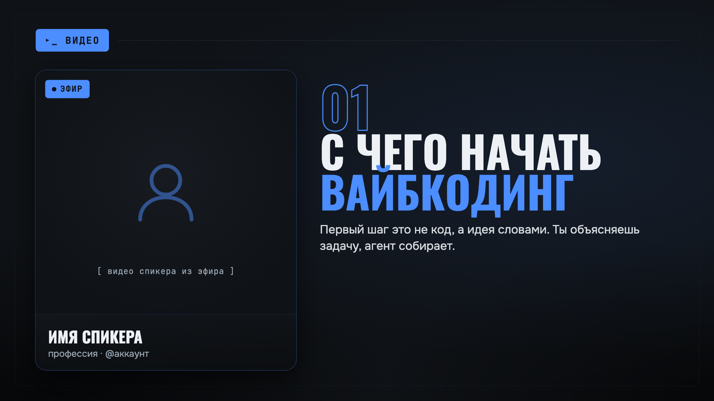

# Шаблоны монтажа (Templates)

Движок собирает ролик по ВЫБРАННОМУ шаблону. Шаблон = композиция (layout) + тема (стиль).
Формат наследуется от исходника, если не сказано иначе.

Как выбрать шаблон при монтаже: скажи агенту тип ролика и стиль, либо укажи флагом
`--template <id>` (и `--theme <id>` для скина). Ниже каталог открытых шаблонов со скринами.

Запускай только одну сборку на checkout. Каждый render получает уникальный public source lease
в `public/.automontage/`, поэтому другой build не подменяет его вход, но `tmp/` и legacy-пути
всё ещё общие. Для параллельного монтажа нужны отдельные clone/worktree.

---

## Открытые шаблоны (в этом репозитории)

### 1. lesson-presentation :: Урок / эфир (9:16 / 16:9)
Режиссёр выбирает раскладку из 7 готовых сцен и заполняет её дословными фразами,
тезисами и цифрами из речи. Код и дизайн сцен не генерируются. Официальная библиотека:
`fullscreen`, `split-top` (JSON-ключ `split`), `bottom-diagram`, `blur-overlay`,
`text-only`, `stat`, `broll`. Экспериментальный `chart` в автоматический план не входит.



Пример стиля выше. Монтаж идёт в два обязательных этапа: сначала ТЗ, затем рендер
только после явного утверждения пользователем.

- Композиция: `ReelScenes` · Публичная тема: `lesson-neutral`
- Если `--theme` не задан, lesson автоматически использует `lesson-neutral`; Dynamic
  по-прежнему использует `craft`.
- По умолчанию `--aspect source`: ширина, высота и FPS равны исходнику.
- `--aspect vertical`: 1080x1920 с FPS исходника.
- `--aspect horizontal`: 1920x1080 с FPS исходника.
- `--face-x`, `--face-y` и `--face-zoom` фиксируют проверенное кадрирование спикера в ТЗ.
- `--tighten` и `--reframe` нужно применять к отдельному исходнику до создания lesson-ТЗ.

Этап 1. Транскрибация, проруф и черновик ТЗ:

```bash
node scripts/build.js <видео> --template lesson \
  --project "ТЕМА РОЛИКА" \
  --aspect source --theme lesson-neutral --title "ТЕМА"
```

Команда создаёт `projects/YYYY.MM.DD_<slug>/`, копирует туда исходник, пишет транскрипт и
`brief/v01-draft.lesson.md` + `.json`, затем останавливается до Remotion. Для этого этапа
нужен `ANTHROPIC_API_KEY` или `OPENAI_API_KEY`.

Необязательно открыть локальную проверку draft можно до утверждения:

```bash
automontage review --project-dir projects/2026.08.20_demo
automontage review --project-dir projects/2026.08.20_demo --edit
automontage review --project-dir projects/2026.08.20_demo --no-open
```

Первая команда read-only и не меняет brief, manifest или render history. Вторая разрешает
adjacent boundary, загрузку AVIF/GIF/JPEG/PNG/WebP или MP4/MOV/M4V/WebM и назначение image/video
готовой `broll`-сцене. После «Добавить медиа» файл только появляется в media lane: Review не
выбирает сцену автоматически. Image default — `cover`; video default — `contain`, старт 0,
`mute`. Плеер и кнопка «Начать с текущего места» задают старт, а селекторы — fit и один из трёх
audio modes. Один immutable asset можно повторять в нескольких сценах с разными настройками.

Save создаёт новую `vNN-draft.lesson.md/.json`, не меняя approved и исходную ревизию. Undo/redo
до Save остаётся в памяти. `--no-open` печатает путь к временному mode-`0600` URL-файлу вместо
bearer URL; файл живёт не дольше 10 минут, до закрытия сервера или обычного `SIGINT`/`SIGTERM`.
После внешнего `409` controls блокируются до безопасной повторной проверки/свежего state;
устаревшие команды не перебазируются молча. Waveform является best-effort: при его ошибке видео,
слова и timeline продолжают работать. Review не умеет менять текст, effects, keyframes, masks,
делать global ripple/OpenCut-экспорт, удалять/перезаписывать imported asset или рендерить draft.

Legacy image остаётся совместимым и не требует миграции:

```json
{
  "scene": "broll",
  "start": 3,
  "end": 6,
  "headCream": "ПРИМЕР",
  "headOrange": "НА ЭКРАНЕ",
  "brollSrc": "broll/growth.png"
}
```

Новый normalized image сохраняется в draft так (путь и SHA создаёт Review, руками их не
придумывают):

```json
{
  "scene": "broll",
  "start": 3,
  "end": 6,
  "headCream": "ПРИМЕР",
  "headOrange": "НА ЭКРАНЕ",
  "brollMedia": {
    "kind": "image",
    "src": "assets/broll/images/123e4567-e89b-42d3-a456-426614174000/media.webp",
    "sha256": "0123456789abcdef0123456789abcdef0123456789abcdef0123456789abcdef",
    "fit": "cover"
  }
}
```

Normalized video добавляет старт и звук:

```json
{
  "scene": "broll",
  "start": 6,
  "end": 9,
  "headCream": "СКРИНКАСТ",
  "headOrange": "ШАГ 1",
  "brollMedia": {
    "kind": "video",
    "src": "assets/broll/video/123e4567-e89b-42d3-a456-426614174001/media.mp4",
    "sha256": "fedcba9876543210fedcba9876543210fedcba9876543210fedcba9876543210",
    "trimStartSec": 1.2,
    "fit": "contain",
    "audioMode": "mix"
  }
}
```

- `fit: "contain"` показывает весь кадр с возможными полями; `cover` заполняет сцену с
  возможной обрезкой краёв.
- `audioMode: "mute"` оставляет исходный голос; `mix` добавляет звук клипа на −18 dB;
  `replace` заменяет исходный голос только внутри сцены с короткой огибающей на стыках.
- У silent video разрешён только `mute`.
- Клип обязан покрыть сцену с тем же frame math, что renderer:
  `round(trimStartSec × fps) + max(1, round((end − start) × fps)) ≤ round(durationSec × fps)`.
  Зацикливания и freeze последнего кадра в V1 нет.
- Approval заново проверяет normalized metadata, master/proxy hashes, duration и audio stream;
  ручной MP4 в legacy `brollSrc` намеренно не проходит.

После правок и явного «утверждаю» заморозь отдельную approved-копию:

```bash
node scripts/project/approve-brief.js \
  projects/2026.08.05_tema-rolika \
  brief/v01-draft.lesson.json
```

Этап 2. Рендер утверждённого листа:

```bash
node scripts/build.js \
  projects/2026.08.05_tema-rolika/input/source.mp4 \
  --template lesson \
  --project-dir projects/2026.08.05_tema-rolika \
  --brief brief/v01-approved.lesson.json \
  --version-label first-render
```

На втором этапе LLM-ключ и повторная транскрибация не нужны. Движок проверяет статус,
тот же исходник, утверждённые тему и аспект, затем передаёт `faceSrc` и `audioSrc` в
`ReelScenes`. Draft, другой исходник, другая тема или другой аспект блокируются до рендера.
Каждая следующая правка получает свой `renders/vNN-<version-label>/`, а принятый файл лежит
в `final/<slug>.mp4`.

Для отдельной сцены approved JSON может содержать `faceSrc: "assets/faces/cutaway.mp4"` или
web-relative video из repository `public/`. Точное значение и тип сцены обязаны совпасть в
approved brief и render props. Build открывает локальный файл без follow, проверяет identity,
копирует его в одноразовый bundle и передаёт Remotion только `.automontage/.../media-N.ext`.
Custom video использует глобальный таймкод сцены и всегда muted; main voice продолжает идти из
top-level `audioSrc`. URL, absolute/traversal path, symlink и image/audio/text здесь запрещены.

Публичный approved fixture без LLM, музыки и внешней темы лежит в
`examples/lesson-neutral-approved.json`. Короткую проверку lesson и Dynamic вместе запускает
`npm run smoke:release`; скрипт оставляет оба финала для просмотра.

### 2. reel-captions :: Вертикаль: говорящая голова + субтитры (9:16)
Спикер на весь экран + караоке-субтитры по словам + плашки/счётчики/врезки.
Для Reels/Shorts/TikTok. Скины: `craft` (кремовый) и `cyber` (тёмный неон).
Это шаблон по умолчанию (собирается без ключей и без транскрипции по готовому листу).

- Композиция: `Dynamic` · Темы: `craft`, `cyber`
- Пайплайн: `node scripts/build.js <видео> [--theme craft|cyber]`
- Демо из коробки: `automontage demo` (лёгкое видео + готовый лист, без ключей)

### 3. highlight :: Крупная цитата (9:16 / 16:9)
Минимал: одна дословная фраза спикера крупно на фоне + подпись. Для нарезок-хайлайтов
и цитат. Скины нейтральные.

- Статус: НЕ реализован (композиции `Highlight` пока нет). Ранняя идея сохранена в
  историческом `PLAN.md`.

---

## Свой приватный бренд-пак (внешние темы)

Фирменный стиль (палитра, шрифты, декор) может лежать ВНЕ этого репозитория – в
отдельной приватной папке или приватном GitHub-репо. Движок подхватывает тему по id,
не таща сам стиль в open-source. Формат внешней темы – ровно тот же объект, что
встроенные (`src/theme/craft.js`): `colors`, `fonts`, `radius`, `cardShadow`,
`cardBorder`, `motion` (+ опц. блок `lesson` для декора уроков).

Структура бренд-пака:

```
мой-бренд-пак/
  themes/
    <theme-id>/
      theme.json     # объект темы (см. пример craft.js)
```

Подключение (на любой машине, без изменения кода движка):

```bash
export THEMES_EXT="/путь/с пробелами/мой-бренд-пак/themes"
node scripts/build.js видео.mp4 --theme <theme-id>
```

```powershell
$env:THEMES_EXT = "C:\путь с пробелами\мой-бренд-пак\themes"
node scripts/build.js видео.mp4 --theme <theme-id>
```

```bat
set "THEMES_EXT=C:\путь с пробелами\мой-бренд-пак\themes"
node scripts\build.js видео.mp4 --theme <theme-id>
```

Загрузчик `scripts/load-ext-theme.js` при `--theme <id>` ищет `$THEMES_EXT/<id>/theme.json`,
читает его объектом и отдаёт в `getTheme`. Встроенные id не требуют внешней папки. Любой
другой явно заданный id работает fail-closed: отсутствие `THEMES_EXT`, файла, блока
`colors` или валидного JSON останавливает сборку до Remotion. Ошибка показывает id, но не
раскрывает абсолютный путь бренд-пака.

### Памятка агенту: подключить приватный стиль на новой машине

Если пользователь монтирует в СВОЁМ фирменном стиле, а стиль живёт в приватном репо:

1. Склонировать движок и приватный бренд-пак рядом:
   `git clone <движок>` и `git clone <приватный-бренд-пак>`
2. Указать путь к темам: `export THEMES_EXT=/путь/к/бренд-пак/themes`
3. Монтировать: `node scripts/build.js видео.mp4 --theme <id-стиля>`

Точный адрес приватного репо и id дефолтного стиля пользователь хранит у себя (в памяти
агента или в README своего бренд-пака) – в этот открытый репозиторий они не пишутся.
