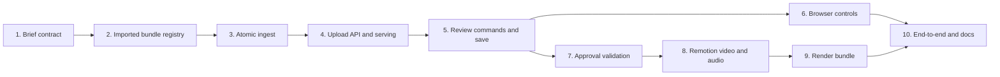

# Video B-roll Media Import Implementation Plan

> **For agentic workers:** REQUIRED SUB-SKILL: Use superpowers:subagent-driven-development (recommended) or superpowers:executing-plans to implement this plan task-by-task with a fresh implementer, specification review, and code-quality review for every task.

**Goal:** Add safe browser import and project-local use of image and video b-roll, including frame-snapped clip starts, contain/cover fitting, and mute/mix/replace audio modes, without changing existing legacy image briefs or the Dynamic render path.

**Architecture:** The Review server streams raw uploads into a private quarantine, normalizes them into immutable project-owned bundles, and exposes only opaque runtime handles plus authenticated preview URLs. Review commands operate on a browser-only media shape; save/approval materialize and revalidate canonical project references and hashes. Lesson rendering copies the approved source and all local b-roll into one owned public snapshot, verifies hashes while copying, and renders a focused Remotion b-roll layer with deterministic 120 ms audio curves.

**Tech Stack:** Node.js 20 CommonJS, `node:test`, Ajv JSON Schema, local argv-only ffmpeg/ffprobe, Remotion 4 React/JSX, `OffthreadVideo`, Playwright Chromium, existing project workspace and Review server primitives.

**Spec:** [2026-08-21-video-broll-media-import-design.md](../specs/2026-08-21-video-broll-media-import-design.md)

## Global Constraints

- Preserve the current `brollSrc` image contract byte-for-byte and keep manually placed non-normalized video preview-only.
- Keep `scripts/public-media.js` behavior unchanged for Dynamic renders. The new multi-file snapshot is lesson-only.
- Never return an absolute path, canonical project reference, SHA-256, quarantine name, ffmpeg stderr, or stack trace to the browser.
- Never build a shell command. Every ffmpeg/ffprobe invocation is an executable plus argv array with `shell: false`. Upload processing uses the dedicated abortable async runner from Task 3; existing synchronous build callers keep the current process runner.
- Keep JSON edit requests at 256 KiB. Route the raw upload before `consumeLimitedBody()` and stream it; never buffer a 1 GiB request in memory.
- Browser commands contain only opaque `asset-N` handles, indexes, finite numbers, and enum values. They never contain `src`, hashes, or filesystem paths.
- One import per Review runtime. Import locks all browser mutations and always releases its semaphore in `finally`.
- No delete/replace UI in V1. Every successful import creates a new UUID-owned bundle.
- New behavior starts with a failing regression test. Each task stops on red, returns to green, runs its focused suite, reviews the diff, and creates exactly one task commit.
- Do not change package version, tag, push, merge, deploy, or release in this plan.
- Do not add tracked binary fixtures. Generate tiny JPEG/WebM/MP4/MOV test media inside per-test temporary directories with argv-only ffmpeg.
- Existing accepted audit state is exactly the documented five moderate `file-type` chain findings and zero high/critical findings. Do not run `npm audit fix` or make unrelated dependency changes.

## Execution Map



The dependency arrows are strict. Tasks 6 and 7 may run in parallel only after Task 5 is green and committed. All other tasks run in order because they change shared contracts.

---

### Task 1: Add the strict persisted b-roll media contract

**Files:**

- Create: `scripts/lesson/broll-media.js`
- Modify: `schema/lesson-brief.schema.json`
- Modify: `scripts/lesson/brief.js`
- Modify: `tests/lesson-brief.test.js`

**Interfaces:**

```js
// scripts/lesson/broll-media.js
const BROLL_MEDIA_KINDS = new Set(['image', 'video']);
const BROLL_FITS = new Set(['contain', 'cover']);
const BROLL_AUDIO_MODES = new Set(['mute', 'mix', 'replace']);

function isCanonicalBrollReference(value) {}
function frameSnapSeconds(seconds, fps) {}
function sceneDurationFrames(scene, fps) {}
function videoEndFrame({ trimStartSec, scene, fps }) {}

module.exports = {
  BROLL_AUDIO_MODES,
  BROLL_FITS,
  BROLL_MEDIA_KINDS,
  frameSnapSeconds,
  isCanonicalBrollReference,
  sceneDurationFrames,
  videoEndFrame,
};
```

**Step 1: Write the failing schema and semantic tests**

Add cases to `tests/lesson-brief.test.js` that prove:

- the existing `brollSrc: 'broll/growth.png'` brief remains valid and its serialized bytes do not need migration;
- a strict image `brollMedia` object is valid;
- a strict video `brollMedia` object is valid;
- exactly one of `brollSrc` and `brollMedia` is required for a `broll` scene;
- new objects reject extra keys;
- image rejects `trimStartSec` and `audioMode`;
- video rejects negative/non-finite start values and unknown fit/audio enums;
- persisted `src` rejects absolute paths, URLs, backslashes, dot segments, browser pseudo-paths, and `asset-N` ids;
- SHA-256 must be exactly 64 lowercase hexadecimal characters;
- `frameSnapSeconds(12.419, 25)` returns `12.4` and rejects invalid FPS/numbers.
- `formatBriefMarkdown()` and the scene summary print the selected new media reference instead of `undefined`, while legacy Markdown output remains unchanged.

Use an exact valid video example:

```js
brollMedia: {
  kind: 'video',
  src: 'assets/broll/video/4af36be4-0b26-4e6f-bd48-8bdd2215a4f1/media.mp4',
  sha256: 'a'.repeat(64),
  trimStartSec: 12.4,
  fit: 'contain',
  audioMode: 'replace',
}
```

**Step 2: Run the focused test and prove RED**

Run:

```bash
node --test tests/lesson-brief.test.js
```

Expected: failures show that `brollMedia` is rejected and mutual exclusion/strict validation does not exist.

**Step 3: Implement the schema union and pure helpers**

In the b-roll scene schema, replace the unconditional `brollSrc` requirement with a `oneOf` contract:

```json
{
  "oneOf": [
    { "required": ["brollSrc"], "not": { "required": ["brollMedia"] } },
    { "required": ["brollMedia"], "not": { "required": ["brollSrc"] } }
  ]
}
```

Define `brollMedia` with strict image/video branches and `additionalProperties: false`. Keep the old image extension check for `brollSrc`; validate new references with `isCanonicalBrollReference()` and snap math with integer frames:

```js
function frameSnapSeconds(seconds, fps) {
  if (!Number.isFinite(seconds) || seconds < 0 || !Number.isFinite(fps) || fps <= 0) {
    throw new TypeError('b-roll frame time is invalid');
  }
  return Math.round(seconds * fps) / fps;
}
```

Do not teach canonical lesson validation about browser-only objects. Those get a separate Review validator in Task 5.

**Step 4: Run focused tests and inspect backward compatibility**

Run:

```bash
node --test tests/lesson-brief.test.js tests/review-compatibility.test.js
git diff --check
```

Expected: all pass; legacy props remain unchanged.

**Step 5: Commit the task**

```bash
git add schema/lesson-brief.schema.json scripts/lesson/broll-media.js scripts/lesson/brief.js tests/lesson-brief.test.js
git commit -m "feat: define video b-roll brief contract"
```

---

### Task 2: Discover and validate immutable imported asset bundles

**Files:**

- Create: `scripts/review/imported-assets.js`
- Create: `tests/review-imported-assets.test.js`
- Modify: `scripts/review/assets.js`
- Modify: `scripts/review/server.js`

**Interfaces:**

```js
// scripts/review/imported-assets.js
function parseImportedAssetMetadata({ bytes, expectedId }) {}
function inspectImportedAssetBundle({ projectDir, assetDirectory, fileSystem = fs }) {}
function listImportedAssetBundles({ projectDir, fileSystem = fs }) {}
function cleanupOrphanImportedStages({ projectDir, fileSystem = fs }) {}

// result used by the Review registry
// {
//   kind: 'project', mediaKind, label, filePath, previewPath,
//   reference, canonicalSha256, previewSha256,
//   width, height, fps, durationSec, hasAudio, capabilities
// }
```

The implementation owns this exact project layout and never derives a path from the display label:

```text
assets/broll/images/<uuid>/media.webp + asset.json
assets/broll/video/<uuid>/media.mp4 + asset.json
previews/broll/<uuid>.webm
```

**Step 1: Write failing metadata and capability tests**

Cover exact `asset.json` keys, UUID-directory equality, label NFKC/control/255-byte rules, lowercase hashes, fixed filenames, image zeroed media fields, video proxy requirement, no symlink traversal, and hash verification.

Add the registry matrix:

| Asset | preview | brollImage | brollVideo |
|---|---:|---:|---:|
| legacy project/public image | true | true | false |
| normalized image bundle | true | true | false |
| normalized video + valid proxy | true | false | true |
| manually placed MP4 | true | false | false |
| normalized video missing/replaced proxy | false or expired | false | false |
| audio-only file | true | false | false |

Also prove descriptors never include `reference`, hashes, or absolute paths.

Keep all new registry cases in the newly created imported-assets test file instead of inventing a second generic asset suite.

Add an exact deduplication assertion: every normalized canonical master appears in exactly one descriptor, using its original metadata label. It must not also appear as a generic recursively scanned `media.mp4`/`media.webp` entry.

For a selectable legacy project/public image, compute and cache a server-only SHA-256 once during registry reconstruction even though it has no `asset.json`. Manual video/audio remains preview-only and does not gain a selectable hash contract. Prove the hash is available to materialization but absent from every browser descriptor/state/response.

**Step 2: Run tests and prove RED**

```bash
node --test tests/review-imported-assets.test.js
```

Expected: imported bundle APIs and split capabilities are missing.

**Step 3: Implement strict discovery**

Read metadata using a descriptor opened with `O_RDONLY | O_NOFOLLOW`, reject unknown keys, and derive all paths from the containing UUID:

```js
const REQUIRED_KEYS = [
  'version', 'id', 'label', 'mediaKind', 'canonicalSha256',
  'previewSha256', 'width', 'height', 'fps', 'durationSec', 'hasAudio',
];

if (!isDeepStrictEqual(Object.keys(metadata).sort(), [...REQUIRED_KEYS].sort())) {
  throw new Error('imported asset metadata shape is invalid');
}
```

Capture `dev`, `ino`, `size`, and nanosecond mtime for canonical and preview files. Verify each SHA once when reconstructing the registry. Preserve current opaque ids across refresh by identity key; allocate a new `asset-N` only for a newly published bundle.

`cleanupOrphanImportedStages()` may inspect only UUID-shaped hidden stages and previews under the exact imported-media parents. It must refuse symlinks and remove only identity-checked owned remnants without a published asset directory.

Make one authoritative discovery function feed both `listReviewAssets()` and the server snapshot map. Imported bundle records take precedence over the broad recursive scan by canonical resolved path, so descriptor order/bootstrap cannot create duplicates or replace the original label with `media.mp4`. Task 2 unit-tests cleanup selection but does not wire it to runtime lifecycle yet; Task 4 owns that integration after the import controller exists.

**Step 4: Run focused tests**

```bash
node --test tests/review-imported-assets.test.js tests/review-server-security.test.js
git diff --check
```

Expected: all pass, including the existing stale-identity behavior.

**Step 5: Commit the task**

```bash
git add scripts/review/imported-assets.js scripts/review/assets.js scripts/review/server.js tests/review-imported-assets.test.js
git commit -m "feat: register normalized b-roll assets"
```

---

### Task 3: Build the bounded atomic media ingest transaction

**Files:**

- Create: `scripts/review/media-import.js`
- Create: `scripts/review/media-process.js`
- Create: `tests/review-media-import.test.js`
- Create: `tests/review-media-process.test.js`
- Create: `tests/helpers/media-fixtures.js`
- Modify: `scripts/media-probe.js`
- Modify: `tests/media-probe.test.js`

**Interfaces:**

```js
// scripts/review/media-import.js
const IMAGE_MAX_BYTES = 25 * 1024 * 1024;
const VIDEO_MAX_BYTES = 1024 * 1024 * 1024;

function parseImportHeaders(headers) {}
function requiredFreeBytes(contentLength) {}
function createImportController() {}
async function importReviewMedia({
  request,
  signal,
  projectDir,
  outputFps,
  headers,
  controller,
  fileSystem = fs,
  runMediaProcessImpl,
  statfsImpl = fs.statfsSync,
  randomId = randomUUID,
}) {}

// createImportController() -> { acquire(): boolean, release(): void, busy: boolean }
// successful import -> authoritative server-only bundle record

// scripts/review/media-process.js
async function runMediaProcess({
  command,
  args,
  cwd,
  signal,
  timeoutMs,
  maxStdoutBytes,
  maxStderrBytes,
  spawnImpl = spawn,
}) {}
```

Extend probing without changing `probeVideo()` callers:

```js
function parseMediaProbeJson(stdout) {
  // returns { mediaKind, width, height, fps, durationSec, hasAudio, rotation }
}
```

**Step 1: Write failing protocol and pure limit tests**

Test header parsing without allocating large bodies:

- canonical positive `Content-Length` only; reject `+1`, whitespace, leading zeroes, missing, duplicate/array values, zero, overflow;
- decoded filename is exactly one URI component; reject malformed escapes, separators, NUL/control characters, double-extension tricks, >255 UTF-8 bytes;
- extension/MIME quick-check matrix and `application/octet-stream` allowance;
- exact byte boundaries: 25 MiB image and 1 GiB video accepted, one byte more rejected;
- `requiredFreeBytes(n) === 4 * n + 512 * 1024 * 1024` using `BigInt`;
- disk reserve checked before any request byte is read.

Test authoritative probe failures: malformed JSON, no primary video stream, MIME/content disagreement, 4K dimension/pixel boundary, >1800 seconds, and decoder failure. Separately prove VFR and rotated inputs are accepted: probing reports their real timing/orientation, normalization applies rotation to pixels, removes rotation metadata, and produces the current brief's fixed output FPS.

Use the exact approved ceilings in assertions: video duration 30 minutes/1,800 seconds, maximum dimension 4,096 and 8,847,360 pixels; image maximum dimension 12,000 and 100,000,000 pixels.

**Step 2: Run pure tests and prove RED**

```bash
node --test tests/review-media-import.test.js tests/review-media-process.test.js tests/media-probe.test.js
```

Expected: missing header parser/import controller/rich probe failures.

**Step 3: Implement quarantine streaming and normalization**

The core transaction must follow this shape:

```js
if (!controller.acquire()) throw mediaImportError(409, 'MEDIA_IMPORT_BUSY');
let owned;
try {
  owned = createOwnedQuarantine(projectDir, randomId());
  await streamExactBody(request, owned.uploadFd, headers.contentLength);
  const probeOutput = await runMediaProcessImpl(buildProbeInvocation(owned.uploadPath));
  const source = parseMediaProbeJson(probeOutput.stdout);
  assertMediaLimits(source, headers.mediaKind);
  await normalizeIntoQuarantine({source, outputFps, owned, runMediaProcessImpl});
  await verifyNormalizedOutputs({owned, runMediaProcessImpl});
  const metadata = buildCanonicalMetadata(owned);
  return publishImportedBundle({projectDir, owned, metadata});
} finally {
  cleanupOwnedImport(owned);
  controller.release();
}
```

Create quarantine with an unpredictable UUID-owned directory, verify its identity/type/no-symlink chain, and require effective mode `0o700` independent of ambient umask. Use `O_CREAT | O_EXCL | O_NOFOLLOW`, file mode `0o600`, exact byte counting, `fsync`, and descriptor close. Abort on early EOF or any byte beyond declared length. On the passed `AbortSignal` or bounded process timeout during processing, send `SIGTERM` to the owned child, await exit, then cleanup. Do not treat the ordinary `IncomingMessage` `close` event as cancellation: it may fire after a complete request body while normalization must continue.

The existing `scripts/process.js` is synchronous and cannot observe a browser disconnect while ffmpeg runs. Do not reuse it for import processing. `scripts/review/media-process.js` must use `spawn()`, `shell: false`, bounded stdout/stderr collectors, an `AbortSignal`, one `SIGTERM`, and a promise that resolves/rejects only after the child `close` event. Do not escalate to `SIGKILL`. V1 assumes ffmpeg/ffprobe honor `SIGTERM`; if a foreign replacement binary ignores it, the import stays busy until that child exits or the Review server is stopped. Startup orphan cleanup handles owned remnants on the next run, but no TTL may remove files while a live child could still write them.

Encode the first visual frame of an image/animated GIF as oriented metadata-free alpha-capable WebP quality 90. The ffmpeg argv must include an explicit single-frame boundary such as `-frames:v 1`, orientation application, metadata stripping, and a pixel format that preserves alpha when the decoded input contains it. Encode video master as H.264/yuv420p/CRF 18/preset medium/current brief FPS/AAC 48k stereo 160k/faststart, without synthesizing audio. Encode a full-duration proxy as VP8 max 1280 and maximum 30 FPS plus Opus 96k when audio exists. Do not apply per-asset `loudnorm`; the existing final mix remains the only loudness normalization. Fully decode-test outputs before publication.

Publish preview first and the complete asset directory last with atomic renames. No failed operation may leave a selectable bundle.

**Step 4: Add lifecycle and hostile-filesystem tests**

Test with injected filesystem/process seams:

- one semaphore owner and immediate second-request `409`;
- release after parse, stream, probe, normalize, publish, and abort failure;
- early EOF, overflow, disconnect, child timeout, non-zero exit;
- exclusive quarantine creation with exact effective directory mode `0o700` and upload mode `0o600`, symlinked parents/destinations, dangling links, parent replacement during ffmpeg;
- preview publish rollback and asset-directory-last visibility;
- no shell invocation and hostile filenames remain display-only;
- successful real tiny JPEG, silent video, and audio video normalize and fully decode.
- a generated two-frame animated GIF produces exactly one decodable `media.webp` whose sampled pixels match the first visual frame;
- a generated transparent PNG produces `media.webp` with its alpha channel preserved.
- exact master argv contains H.264, `yuv420p`, CRF 18, preset medium, current brief FPS, `+faststart`, metadata removal, and conditional AAC 48 kHz/stereo/160 kbit/s;
- exact proxy argv contains VP8, aspect-preserving maximum dimension 1,280, maximum 30 FPS, full-duration processing, metadata removal, and conditional Opus 48 kHz/stereo/96 kbit/s;
- ffprobe of landscape and portrait outputs confirms preserved aspect, master codec/pixel format/FPS, proxy dimensions `<=1280`, proxy FPS `<=30`, and proxy duration within one output frame of the master;
- ffprobe confirms silent input has no synthesized audio in master or proxy, while audio input has AAC stereo 48 kHz in the master and Opus stereo 48 kHz in the proxy. Bitrate/profile flags are asserted from argv because encoder/container reporting may vary.

Generate the real fixtures in `tests/helpers/media-fixtures.js` with local ffmpeg argv and skip with an explicit reason only when ffmpeg is unavailable.

**Step 5: Run focused tests and commit**

```bash
node --test tests/review-media-import.test.js tests/review-media-process.test.js tests/media-probe.test.js
git diff --check
git add scripts/review/media-import.js scripts/review/media-process.js scripts/media-probe.js tests/review-media-import.test.js tests/review-media-process.test.js tests/media-probe.test.js tests/helpers/media-fixtures.js
git commit -m "feat: normalize browser media imports"
```

---

### Task 4: Expose the authenticated upload and proxy routes

**Files:**

- Modify: `scripts/review/server.js`
- Modify: `tests/review-server-security.test.js`
- Modify: `tests/review-model.test.js`

**Interfaces:**

```js
// startReviewServer additions, all optional for test injection
startReviewServer({
  ...existing,
  importMediaImpl = importReviewMedia,
  runMediaProcessImpl = runMediaProcess,
  statfsImpl = fs.statfsSync,
  importController = createImportController(),
})
```

`routeRequest()` must branch to `POST /api/assets/import` after token/unsafe-path/Origin/edit checks but before `consumeLimitedBody()`.

**Step 1: Write failing route tests**

Add real HTTP assertions for:

- missing token `401`, wrong Origin `403`, read-only `405`, wrong method `405` before consuming upload bytes;
- malformed headers/status mapping `400/413/415/422/507` with fixed error bodies;
- JSON validate/save still enforce 256 KiB and content type;
- successful upload returns `201` opaque descriptor only;
- busy import returns `409` without reading the second body;
- validate/save and a second import return `409 MEDIA_IMPORT_BUSY` while normalization is active, while authenticated state/media reads remain available and cannot clean the in-flight preview;
- a fully received request continues processing after the request stream closes normally;
- aborting XHR after upload reaches 100% but before the response closes aborts the child and publishes no asset;
- `/media/assets/:id/preview` requires auth, supports HEAD/range, `nosniff`, and only serves the registered proxy snapshot;
- replacement of canonical or proxy expires the handle and never follows a symlink;
- `/api/state` reconstructs an imported asset after a server restart with a stable descriptor contract.

Assert the full fixed status map: `400` malformed protocol, `401` authentication, `403` Origin, `405` method/read-only, `409` busy or identity conflict, `413` byte limit, `415` extension/MIME quick rejection, `422` decode/media validation, `507` disk reserve, and generic `500` for unexpected internals.

Add runtime cleanup integration tests here, after `createImportController()` exists: startup removes only an identity-checked stale hidden stage/orphan preview; idle refresh repeats that cleanup; refresh during preview-first publication skips cleanup and preserves the in-flight preview. A valid bundle, unrelated file, and symlink target remain untouched.

**Step 2: Run the focused server tests and prove RED**

```bash
node --test tests/review-server-security.test.js tests/review-model.test.js
```

Expected: import route and preview route are absent.

**Step 3: Implement early route dispatch and registry refresh**

Use this order:

```js
if (pathname === '/api/assets/import') {
  if (request.method !== 'POST') return rejectWithoutBody(...);
  if (!editable) return rejectWithoutBody(...);
  const imported = await importMediaImpl({
    request,
    signal: importAbortController.signal,
    projectDir,
    outputFps: runtime.state.output.fps,
    headers: request.headers,
    controller: runtime.importController,
    fileSystem,
    runMediaProcessImpl,
    statfsImpl,
  });
  const refreshed = refreshAssetFiles({root, projectDir, runtime});
  runtime.assetFiles = refreshed.assetFiles;
  runtime.state = {...runtime.state, assets: refreshed.descriptors};
  return sendJson(response, 201, {ok: true, asset: descriptorForPublished(imported, runtime)});
}

const bodyBytes = await consumeLimitedBody(request, response);
```

Keep all process/filesystem diagnostics in sanitized server logs only. Do not echo the caught error string in a response.

Wire `cleanupOrphanImportedStages()` once before initial discovery and before an idle registry refresh. Gate refresh cleanup on `runtime.importController.busy === false`; a read during active normalization may rebuild state but must not delete the preview-first publication window.

Create one `AbortController` in the upload route. Abort it on `request.aborted`, or when the response/socket closes while `response.writableEnded === false` and the import promise is still pending. Remove all listeners in `finally`. Never bind import cancellation directly to an unqualified `request.on('close')` event.

**Step 4: Run focused tests and inspect response privacy**

```bash
node --test tests/review-server-security.test.js tests/review-model.test.js tests/review-imported-assets.test.js
git diff --check
```

Manually inspect the new JSON assertions: only opaque id, kind, mediaKind, label, fixed URLs, geometry/duration/audio, and capability booleans are allowed.

**Step 5: Commit the task**

```bash
git add scripts/review/server.js tests/review-server-security.test.js tests/review-model.test.js
git commit -m "feat: expose secure review media upload"
```

---

### Task 5: Add browser-safe media commands, diffs, and server materialization

**Files:**

- Modify: `scripts/review/commands.js`
- Modify: `scripts/review/diff.js`
- Modify: `scripts/review/model.js`
- Modify: `scripts/review/server.js`
- Modify: `scripts/project/workspace.js`
- Modify: `tests/review-commands.test.js`
- Modify: `tests/review-model.test.js`
- Modify: `tests/review-draft-save.test.js`

**Interfaces:**

```js
// Review-only safe scene shape; never persisted
brollMedia: {
  kind: 'image' | 'video',
  assetId: 'asset-7',
  fit: 'contain' | 'cover',
  trimStartSec?: 12.4,
  audioMode?: 'mute' | 'mix' | 'replace',
}

function applyReviewCommand({ brief, command, assets, fps }) {}
function applyReviewCommands({ brief, commands, assets, fps }) {}
function validateReviewCandidate({ candidate, base, assets, fps }) {}
function buildReviewCandidateBase({ canonicalBrief, assetFiles }) {}
function materializeReviewAssets({ root, current, assetFiles, candidate, words }) {}
```

`assets` is a `Map<assetId, serverDescriptor>` containing trusted media kind, duration, audio, canonical reference, and hash. It replaces the current `assetIds` set.

**Step 1: Write failing command tests**

Add exact-key tests for:

```js
{type: 'replace-broll', sceneIndex: 1, assetId: 'asset-7'}
{type: 'set-broll-fit', sceneIndex: 1, fit: 'cover'}
{type: 'set-broll-video-start', sceneIndex: 1, trimStartSec: 12.419}
{type: 'set-broll-audio-mode', sceneIndex: 1, audioMode: 'replace'}
```

Prove defaults: image → `cover`; video → `contain`, `0`, `mute`. Prove 25 FPS snaps `12.419` to `12.4`. Reject extra keys, unknown ids, wrong scene kind, video-only settings on images, `mix/replace` without audio, and `trimStartFrame + sceneFrames > clipFrames`.

Prove immutable replay, undo/redo-compatible command arrays, protected identity, and unsupported diff rejection. Diffs must use only safe values and kinds `asset`, `fit`, `clip-start`, `audio-mode`.

**Step 2: Write failing model/materialization tests**

Prove:

- persisted `src` and hash map to an opaque UI object only when current registered reference and hash both match;
- selecting a legacy public/project image, saving it as new `brollMedia`, restarting the real server, and reloading state resolves the same safe selection because the generic image hash is reconstructed and cached server-side;
- unresolved media returns a safe diagnostic and locks that scene without exposing the original values;
- browser-safe state JSON contains no host-specific absolute path, `assets/broll/...`, or
  64-character hash;
- materialization replaces `assetId` with trusted `src` and hash, never a browser-provided value;
- a boundary-only edit keeps an untouched legacy `brollSrc` byte-for-byte and does not silently migrate it to `brollMedia`;
- validate/save rechecks current identities, duration, audio eligibility, and SHA before allocating a revision;
- save keeps the prior approved bytes unchanged and persists frame-snapped seconds.

**Step 3: Run focused tests and prove RED**

```bash
node --test tests/review-commands.test.js tests/review-model.test.js tests/review-draft-save.test.js
```

Expected: new commands and safe materialization are missing.

**Step 4: Implement a separate Review candidate validator**

Do not pass browser-only objects through canonical Ajv validation. Validate the internal candidate explicitly, preserve protected fields, then materialize before `validateLessonBrief()`:

```js
function selectedAsset(scene, assets) {
  const media = scene && scene.brollMedia;
  return media && isOpaqueAssetId(media.assetId) ? assets.get(media.assetId) : null;
}

function applyReplaceBroll(candidate, command, assets) {
  const asset = requireSelectableAsset(command, assets);
  delete candidate.scenes[command.sceneIndex].brollSrc;
  candidate.scenes[command.sceneIndex].brollMedia = asset.mediaKind === 'video'
    ? {kind: 'video', assetId: command.assetId, trimStartSec: 0, fit: 'contain', audioMode: 'mute'}
    : {kind: 'image', assetId: command.assetId, fit: 'cover'};
}
```

At the start of every validate/save replay, call `buildReviewCandidateBase()` on the freshly loaded canonical brief. It must:

- keep legacy `brollSrc` only in the server-side candidate so unrelated edits preserve it exactly;
- project a resolvable persisted `brollMedia` to `{kind, assetId, fit, trimStartSec?, audioMode?}`;
- mark an unresolved persisted `brollMedia` as blocked without retaining its `src` or hash in browser state;
- feed the exact same projected base to `diffLessonBrief()` and command replay so a no-op remains a no-op.

`browserScene()` removes the server-only legacy `brollSrc` before serialization. Delete absent properties rather than serializing `undefined`. `browserSafeDiff()` must translate legacy previous selections to opaque ids or `null` and never include a canonical reference.

Before draft publication, resolve and open the registered canonical file, check its current snapshot, probe media, hash the opened bytes, validate duration/audio, and construct the persisted `brollMedia` object.

**Step 5: Run focused tests and commit**

```bash
node --test tests/review-commands.test.js tests/review-model.test.js tests/review-draft-save.test.js tests/review-server-security.test.js
git diff --check
git add scripts/review/commands.js scripts/review/diff.js scripts/review/model.js scripts/review/server.js scripts/project/workspace.js tests/review-commands.test.js tests/review-model.test.js tests/review-draft-save.test.js
git commit -m "feat: edit video b-roll safely"
```

---

### Task 6: Build the browser import and per-scene media controls

**Files:**

- Create: `review/media-import.js`
- Modify: `review/app.js`
- Modify: `review/timeline.js`
- Modify: `review/index.html`
- Modify: `review/styles.css`
- Modify: `tests/review-ui.spec.js`

**Interfaces:**

```js
// review/media-import.js
export function createMediaImporter({
  endpoint,
  token,
  origin,
  onPhase,
  onProgress,
  onSuccess,
  onError,
}) {}

// returned controller
// { importFile(file): Promise<object>, abort(): void, busy(): boolean }
```

**Step 1: Write failing Playwright tests**

Use the real Review server and runtime-generated media. Prove:

- `Добавить медиа` is absent read-only and present edit-only;
- real JPEG upload shows byte progress, then processing text, then an image thumbnail without auto-selecting it;
- real MP4/MOV and VP8/WebM inputs produce a playable authenticated proxy;
- upload locks boundary dragging, b-roll selectors, undo, redo, validate, save, and the upload button;
- a second import cannot start;
- failure/abort restores controls and preserves commands/diff;
- identity conflict enters the current synchronous conflict quarantine;
- selecting video shows proxy player and defaults contain/zero/mute;
- `Начать с текущего места` dispatches a frame-snapped value;
- no-audio video disables `mix` and `replace`;
- fit/start/audio changes participate in undo/redo and validation;
- labels are inserted with `textContent`, never HTML.

**Step 2: Run the focused browser cases and prove RED**

```bash
npm run test:review-ui -- --grep "media import|video b-roll"
```

Expected: upload UI and video controls do not exist.

**Step 3: Implement raw XHR import state**

Use `XMLHttpRequest` because upload progress is required:

```js
xhr.open('POST', endpoint);
xhr.setRequestHeader('Authorization', `Bearer ${token}`);
xhr.setRequestHeader('X-Automontage-Filename', encodeURIComponent(file.name));
xhr.setRequestHeader('Content-Type', file.type || 'application/octet-stream');
xhr.upload.onprogress = ({loaded, total}) => onProgress({loaded, total});
xhr.upload.onload = () => onPhase('processing');
xhr.send(file);
```

Do not try to set `Content-Length` in browser JavaScript. On success, refresh `/api/state`; do not auto-dispatch `replace-broll`.

Reuse the existing global mutation lock and conflict quarantine rather than creating a second lock model. An import owns the lock until success refresh or error cleanup completes.

**Step 4: Render media lane and scene controls**

- Images keep thumbnail behavior.
- Videos use only authenticated `previewUrl`, show duration/dimensions/audio badge, and never use the canonical URL for playback.
- Each b-roll scene renders selector plus conditional fit/start/audio controls.
- Use the selected proxy player's `currentTime`; the server remains authoritative for frame snapping.
- Disable all mutations while saving/importing/conflicted; keep the existing explicit discard rule after 409.

**Step 5: Run browser and adjacent Node tests**

```bash
npm run test:review-ui -- --grep "media import|video b-roll|b-roll controls|stale conflict"
node --test tests/review-commands.test.js tests/review-model.test.js tests/review-server-security.test.js
git diff --check
```

Expected: focused browser and Node tests pass.

**Step 6: Commit the task**

```bash
git add review/media-import.js review/app.js review/timeline.js review/index.html review/styles.css tests/review-ui.spec.js
git commit -m "feat: add browser video b-roll controls"
```

---

### Task 7: Re-probe and freeze b-roll media at draft approval

**Files:**

- Create: `scripts/lesson/broll-media-files.js`
- Modify: `scripts/project/workspace.js`
- Modify: `scripts/project/approve-brief.js`
- Modify: `tests/project-workspace.test.js`
- Modify: `tests/review-draft-save.test.js`

**Interfaces:**

```js
// scripts/lesson/broll-media-files.js
function resolvePersistedBrollMedia({ root, workspace, media, fileSystem = fs }) {}
function verifyPersistedBrollMedia({ root, workspace, scene, fps, runToolImpl, fileSystem = fs }) {}
function verifyBriefBrollMedia({ root, workspace, brief, runToolImpl, fileSystem = fs }) {}
```

**Step 1: Write failing approval and replacement tests**

Prove:

- a valid normalized image/video draft approves;
- after the valid happy path is GREEN, missing/replaced media, changed hash, symlink, wrong metadata, proxy loss, clip overrun, or `replace` without audio each abort with its own exact stable error code/message before any approved JSON/Markdown/manifest publication;
- a race that replaces the registered media between validation and approval is detected;
- the draft remains byte-for-byte and status `draft` after rejection;
- legacy image `brollSrc` approval remains unchanged;
- manually placed MP4 in legacy `brollSrc` remains rejected.

**Step 2: Run focused tests and prove RED**

```bash
node --test tests/project-workspace.test.js tests/review-draft-save.test.js
```

Expected: canonical validator understands shape but approval does not re-probe/hash video media.

The RED proof must assert the specific expected reason for every negative case. A generic `b-roll supports only images`/missing `brollSrc` rejection does not count as RED or GREEN for hash, identity, duration, proxy, or audio validation.

**Step 3: Implement one shared filesystem verifier**

Resolve project references only beneath the workspace and public references only beneath repository `public/`. Open with no-follow, capture identity, hash opened bytes, probe the canonical master, validate kind/duration/audio, then assert the same identity before returning.

Approval must run `verifyBriefBrollMedia()` before staging outputs and repeat identity assertions at the existing commit boundary. Pass dependencies from `approveBrief()` so tests can inject filesystem/process races without spawning a shell.

**Step 4: Run focused tests and commit**

```bash
node --test tests/project-workspace.test.js tests/review-draft-save.test.js tests/lesson-brief.test.js
git diff --check
git add scripts/lesson/broll-media-files.js scripts/project/workspace.js scripts/project/approve-brief.js tests/project-workspace.test.js tests/review-draft-save.test.js
git commit -m "feat: verify b-roll media before approval"
```

---

### Task 8: Render image/video b-roll and deterministic audio modes

**Files:**

- Create: `src/scenes/BrollMedia.jsx`
- Modify: `src/scenes/scenes.jsx`
- Modify: `src/SceneDirector.jsx`
- Create: `tests/scene-broll-media.test.js`
- Modify: `tests/scene-media-sync.test.js`
- Modify: `tests/scene-music.test.js`

**Interfaces:**

```jsx
// src/scenes/BrollMedia.jsx
export const MIX_GAIN = 10 ** (-18 / 20);
export const fadeFramesForFps = (fps) => Math.max(1, Math.round(0.12 * fps));
export const brollEnvelope = ({localFrame, durationInFrames, fps}) => 0;
export const brollClipVolume = ({mode, localFrame, durationInFrames, fps}) => 0;
export const sourceVolumeForFrame = ({frame, scenes, fps}) => 1;
export const BrollMedia = ({media, legacySrc, durationInFrames}) => null;
```

**Step 1: Write failing pure audio tests**

Load JSX through the existing esbuild test helper pattern. For 24, 25, 29.97, and 30 FPS, assert:

- `MIX_GAIN` equals `10 ** (-18 / 20)`;
- first and final local frames are zero;
- pre-fade, midpoint, plateau, and final fade match the spec formula;
- a <240 ms scene peaks at or below target with no discontinuity;
- mute returns no clip volume, mix returns gain × envelope, replace returns envelope;
- source stays `1` for mute/mix and equals `1-envelope` for replace;
- adjacent non-overlapping replace scenes never combine two envelopes.

**Step 2: Write failing component/timing tests**

Assert:

- legacy `brollSrc` and image `brollMedia` render `Img`;
- video renders `OffthreadVideo` with `trimBefore = round(trimStartSec * fps)`;
- contain/cover become exact `objectFit` values;
- mute passes `muted`; mix/replace pass deterministic volume callbacks;
- source speaker video still uses global `sourceStartFrame`;
- scene `Sequence` has `premountFor={Math.round(fps)}` while visible from/duration stay unchanged;
- the single global source `Audio` remains mounted from frame zero and receives the source-volume callback.

**Step 3: Run focused tests and prove RED**

```bash
node --test tests/scene-broll-media.test.js tests/scene-media-sync.test.js tests/scene-music.test.js
```

Expected: `BrollMedia` helpers and source ducking are absent.

**Step 4: Implement the focused media layer**

Use the exact envelope:

```js
export const brollEnvelope = ({localFrame, durationInFrames, fps}) => {
  const fade = fadeFramesForFps(fps);
  const fadeIn = clamp01(localFrame / fade);
  const fadeOut = clamp01((durationInFrames - 1 - localFrame) / fade);
  return Math.min(fadeIn, fadeOut);
};
```

`SceneBroll` delegates visuals/audio to `BrollMedia`. `SceneDirector` computes absolute scene intervals once and gives the global source `<Audio>` a frame callback. Do not add a second source audio track and do not move audio to scene-local `Sequence`s.

**Step 5: Run focused and compatibility tests**

```bash
node --test tests/scene-broll-media.test.js tests/scene-media-sync.test.js tests/scene-music.test.js tests/review-compatibility.test.js
git diff --check
```

Expected: all pass; legacy rendering and music behavior remain green.

**Step 6: Commit the task**

```bash
git add src/scenes/BrollMedia.jsx src/scenes/scenes.jsx src/SceneDirector.jsx tests/scene-broll-media.test.js tests/scene-media-sync.test.js tests/scene-music.test.js
git commit -m "feat: render video b-roll audio modes"
```

---

### Task 9: Snapshot all approved lesson media for rendering

**Files:**

- Create: `scripts/render-media-bundle.js`
- Modify: `scripts/lesson/workflow.js`
- Modify: `scripts/build.js`
- Create: `tests/render-media-bundle.test.js`
- Modify: `tests/lesson-build.test.js`
- Modify: `tests/public-media.test.js`

**Interfaces:**

```js
// scripts/render-media-bundle.js
function prepareRenderMediaBundle({
  root,
  workspace,
  props,
  approvedBrief,
  sourcePath,
  namespace,
  temporaryId = randomUUID(),
  fileSystem = fs,
}) {}

function withRenderMediaBundle(options, operation) {}

// lease -> { props: clonedAndRewrittenProps, directory, cleanup }
```

**Step 1: Write failing bundle tests**

Prove:

- source plus local legacy image plus normalized image/video are copied into one unique `public/.automontage/<namespace>-<uuid>/` directory;
- identical resolved files deduplicate;
- copied basenames are generated and preserve only safe required extensions;
- b-roll SHA is calculated from descriptor-copied bytes and must match the approved brief;
- project/public containment, every ancestor, descriptor identity, regular-file type, and no-follow are enforced;
- legacy remote image URLs stay unchanged; new `brollMedia` URLs are impossible;
- only a cloned props object is rewritten; approved brief and input props remain unchanged;
- render success/failure cleans only its own bundle;
- concurrent leases never collide;
- a hash/identity mismatch fails before the Remotion runner is invoked;
- existing `preparePublicMedia()`/`withPublicMediaLease()` tests and Dynamic behavior remain unchanged.

**Step 2: Run focused tests and prove RED**

```bash
node --test tests/render-media-bundle.test.js tests/lesson-build.test.js tests/public-media.test.js
```

Expected: only the one-source lease exists.

**Step 3: Implement descriptor-based bundle copy and prop rewrite**

Collect mappings from approved references to generated public paths. For `brollMedia`, hash during descriptor copy:

```js
const digest = createHash('sha256');
for (;;) {
  const bytesRead = fileSystem.readSync(sourceFd, buffer, 0, buffer.length, null);
  if (bytesRead === 0) break;
  digest.update(buffer.subarray(0, bytesRead));
  writeAll(destinationFd, buffer.subarray(0, bytesRead));
}
if (expectedSha && digest.digest('hex') !== expectedSha) {
  throw new Error('render media hash mismatch');
}
```

Verify source identity before and after copy. Create the lease directory exclusively, record its identity, and cleanup only when exact parent/name/type/identity checks still match.

Update lesson workflow to return approved media context and `build.js` to call `withRenderMediaBundle()` only for lesson render. Remove lesson's call to `bindLessonSourceLease`; keep that function and `withPublicMediaLease()` behavior for compatibility until all existing callers/tests prove it is safe to retire separately.

**Step 4: Run focused build/security tests**

```bash
node --test tests/render-media-bundle.test.js tests/lesson-build.test.js tests/public-media.test.js tests/build-security.test.js tests/render-chunks-security.test.js
git diff --check
```

Expected: lesson uses the bundle, Dynamic keeps its old lease, all cleanup/security tests pass.

**Step 5: Commit the task**

```bash
git add scripts/render-media-bundle.js scripts/lesson/workflow.js scripts/build.js tests/render-media-bundle.test.js tests/lesson-build.test.js tests/public-media.test.js
git commit -m "feat: snapshot lesson render media"
```

---

### Task 10: Prove the full workflow and synchronize documentation

**Files:**

- Create: `tests/video-broll-e2e.test.js`
- Create: `scripts/accept-video-broll.js`
- Modify: `tests/review-ui.spec.js`
- Modify: `README.md`
- Modify: `ARCHITECTURE.md`
- Modify: `docs/TEMPLATES.md`
- Modify: `TESTING.md`
- Modify: `DECISIONS.md`
- Modify: `CHANGELOG.md`

**Interfaces:**

```bash
node scripts/accept-video-broll.js
```

The acceptance script creates a temporary project and temporary generated media, runs the real local Review server and canonical CLI boundaries, writes evidence only beneath ignored `tmp/` or the OS temp directory, and exits non-zero on any mismatch.

**Step 1: Write the failing end-to-end acceptance test**

The real temporary project must perform:

```text
generate JPEG + audio MOV/MP4 + silent MP4/WebM
→ upload all three through real HTTP/browser paths
→ verify authenticated image/proxy playback
→ assign four b-roll scenes: image, silent video, audio video, repeated audio video
→ configure silent video as mute, first audio use as mix, second audio use as replace, plus fit/start
→ validate
→ save one new draft
→ approve through scripts/project/approve-brief.js
→ render through the canonical lesson CLI path
→ fully decode the final
→ ffprobe geometry, FPS, duration, video, and audio
→ sample frames/contact sheet
→ measure source/clip audio before, inside, and after replace
→ prove prior approved brief/render bytes and prior manifest entries remain unchanged
→ prove exactly one new render entry is added and latestRender advances to it
```

Use tiny deterministic fixtures and a short render. The test must not mock ffmpeg, Remotion, the Review server, save, approval, or bundle copy.

**Step 2: Run acceptance and prove RED**

```bash
node --test tests/video-broll-e2e.test.js
```

Expected: it fails until all real workflow wiring and acceptance helper are present.

**Step 3: Implement the acceptance runner and close integration gaps**

Keep the script a thin orchestrator over public APIs/CLI. It may generate fixtures and calculate hashes/probes, but it must not duplicate production import, approval, or render logic.

If this step reveals a bug, add the narrowest failing regression test in the owning earlier test file before changing production code. Do not weaken the acceptance assertion or replace a real boundary with a mock.

**Step 4: Update user and maintainer documentation**

- `README.md`: simple browser workflow, supported formats/limits, “upload does not auto-select,” video start/fit/audio choices, and explicit save/approval/render flow.
- `ARCHITECTURE.md`: quarantine → normalized bundle → opaque registry → Review command → persisted hash → render bundle → Remotion audio flow.
- `docs/TEMPLATES.md`: legacy image and new image/video JSON examples, three audio modes, duration rule.
- `TESTING.md`: focused Node/Chromium/acceptance commands and expected audit exception.
- `DECISIONS.md`: normalized master+proxy, `OffthreadVideo` for V1, one import, immutable UUID assets, no delete/replace, no per-asset loudness normalization.
- `CHANGELOG.md`: compatible feature under `[Unreleased]`; do not bump version.

**Step 5: Run the whole feature matrix**

```bash
node --test tests/video-broll-e2e.test.js
npm test
npm run test:review-ui
npm audit --audit-level=high
npm run check:release
git diff --check
```

Expected:

- all Node and Chromium tests pass;
- acceptance fully decodes and probes the final;
- audit exits zero with exactly the documented five moderate `file-type` chain findings and no high/critical findings;
- release check passes;
- diff check is clean.

**Step 6: Perform visual and privacy review**

Open the generated contact sheet and verify:

- contain preserves a full screencast frame;
- cover fills the scene without blank bars;
- image b-roll remains sharp;
- transitions show no black/blank frame;
- labels and controls are understandable in Russian;
- browser state/responses/log assertions expose no absolute path or hash.

Record the exact artifact paths and probe results in a task report under:

```text
.superpowers/sdd/2026-08-21-video-broll-media-import/final-report.md
```

The report is local evidence, not a release note.

**Step 7: Commit the task**

```bash
git add tests/video-broll-e2e.test.js scripts/accept-video-broll.js tests/review-ui.spec.js README.md ARCHITECTURE.md docs/TEMPLATES.md TESTING.md DECISIONS.md CHANGELOG.md
git commit -m "feat: complete video b-roll import workflow"
```

---

## Final Branch Verification and Review

After Task 10 is committed, use `superpowers:verification-before-completion`, then `superpowers:requesting-code-review`.

1. Confirm the worktree is clean and inspect task commits:

```bash
git status --short
git log --oneline 5922bcf..HEAD
```

2. Re-run from the committed HEAD:

```bash
npm ci
npm test
npm run test:review-ui
npm audit --audit-level=high
npm run check:release
node scripts/accept-video-broll.js
git diff --check 5922bcf..HEAD
```

3. Run two independent reviews:

- Specification reviewer: map every requirement in the approved design spec to code, tests, or documented non-goal; reject any silent omission.
- Code/security reviewer: inspect upload streaming, process aborts, path containment, symlink/race behavior, opaque response privacy, immutable save/approval, Remotion timing/audio, and cleanup ownership.

4. For every reviewer finding, reproduce RED with a regression test before changing code, run the focused suite, then repeat full committed-HEAD verification. Do not mark a finding resolved from inspection alone.

5. Stop before push/tag/merge/release and hand the user:

- final commit SHA;
- Node and Chromium test counts;
- audit summary;
- acceptance output and contact-sheet path;
- concise user workflow;
- residual risks: CPU/disk cost, browser request-open processing time, no SIGKILL guarantee, no delete/overwrite in V1, and `OffthreadVideo` as the V1 renderer.

## Plain-language Result

When this plan is complete, the flow becomes:

```text
Вы выбрали фото или видео в браузере
→ сервер безопасно сделал рабочую копию внутри текущего проекта
→ браузер получил только безопасную карточку предпросмотра
→ вы назначили её конкретной b-roll-сцене
→ выбрали кадрирование, начало и звук
→ Save создал новый draft, не трогая approved
→ после явного утверждения рендер проверил хэши и собрал ролик из одного снимка
```

Existing projects and old image-only briefs continue to work as before.
