# AutoMontage-Agent 1.4.0 Release Implementation Plan

> **For agentic workers:** REQUIRED SUB-SKILL: Use `superpowers:executing-plans` to implement this plan task-by-task. Steps use checkbox (`- [ ]`) syntax for tracking. Work inline without subagents unless the user explicitly asks for delegation.

**Goal:** Publish AutoMontage-Agent v1.4.0 with the fast editing workflow, subscription-first instructions, a clean public Git tree, green cross-platform CI, and a verified GitHub Release.

**Architecture:** Preserve the current uncommitted implementation, move it from `main` to a dedicated release branch, audit every public file before staging, and publish through a pull request rather than pushing directly to `main`. Keep the product's local/private boundary unchanged: user projects, media, renders, memories, secrets, private themes, and browser artifacts never enter Git.

**Tech Stack:** Git/GitHub CLI, Node.js 20, npm, Remotion, ffmpeg/ffprobe, Playwright Chromium, Gitleaks, GitHub Actions.

**Spec:** `docs/superpowers/specs/2026-08-23-fast-video-editing-workflow-design.md`; implementation source: `docs/superpowers/plans/2026-08-23-fast-video-editing-workflow.md`.

## Global Constraints

- Release version is `1.4.0`: the branch adds backward-compatible user-facing commands and capabilities, so SemVer requires a minor release rather than patch `1.3.1`.
- Standard local montage uses the user's Claude Code or Codex subscription and must not request, inspect, or spend Anthropic/OpenAI API keys.
- An API key may be used only after an explicit user request for an external OpenAI image-generation step; it is not part of transcription, draft preparation, preview, Review, approval, final render, or QA.
- Final render remains approved-only; draft preview remains isolated in `previews/`.
- Do not change, delete, stage, or publish the existing ignored finished client project.
- Do not stage `projects/`, `out/`, `tmp/`, `test-results/`, `.env*`, local memory, `_progress.md`, private themes, source media, music, previews, renders, or final MP4 files.
- Never use `git add -A` or `git add .` for this release. Stage explicit paths and inspect the staged tree before every commit.
- Do not push, merge, tag, or publish a GitHub Release until the corresponding explicit user confirmation. Never merge red CI.
- Run focused checks while editing. Run the full Node, Chromium, smoke, security, and release gates once against the final candidate.

## Release flow

```mermaid
flowchart LR
  A[Dirty main preserved] --> B[Create release branch]
  B --> C[Ignore audit and subscription-first docs]
  C --> D[Feature and docs commit]
  D --> E[Version 1.4.0 release metadata]
  E --> F[Full local release gates]
  F --> G[Push release branch]
  G --> H[Pull request and four CI jobs]
  H -->|all green| I[Merge to main]
  I --> J[Annotated v1.4.0 tag]
  J --> K[GitHub Release and fresh-clone smoke]
```



## File map

**Privacy and publication boundary**

- Modify: `.gitignore` — ignore Playwright/browser output such as `test-results/` while preserving public adapters.
- Track: `.agents/skills/reel-turnkey/SKILL.md` — third agent adapter, byte-identical in purpose to the existing `.claude` and `.codex` adapters.
- Preserve outside Git: `projects/`, local memory, `_progress.md`, `.env*`, private themes, media, benchmark temp output.

**Subscription-first public instructions**

- Modify: `README.md` — default installation and montage path; clear statement that normal work uses subscription only.
- Modify: `docs/TEMPLATES.md` — lesson creation without provider API calls; API-backed generator is not the default path.
- Modify: `docs/REVIEW-WORKBENCH.md` — browser workflow, preview, approval, render, and no-key expectations.
- Modify: `skills/reel-turnkey/SKILL.md` — prohibit automatic key checks/requests in ordinary montage sessions.
- Modify: `skills/reel-turnkey/evals/evals.json` — regression prompt requiring subscription-only behavior.
- Modify: `skills/README.md` — list `.agents`, `.claude`, and `.codex` thin adapters.
- Modify: `.env.example` — clearly separate optional explicit provider experiments from the default montage path.
- Modify: `AGENTS.md` — stable project rule for future sessions.
- Modify: `DECISIONS.md` — record subscription-first operation as a durable decision.
- Modify: `skills/reel-turnkey/evals/evals.json` — behavioral pressure case that prevents future sessions from requesting mandatory API keys.

**Fast editing documentation**

- Modify: `ARCHITECTURE.md`, `TESTING.md`, `CHANGELOG.md`, `docs/editing-rules.md`.
- Track: `docs/REVIEW-WORKBENCH.md`, `docs/SCENE-CATALOG.md`, the approved design/plan, golden examples, schemas, preview/master/QA modules, and their focused tests.
- Verify: every new command (`master`, `preview`, `qa:preview`) has reference, how-to, and explanation coverage.

**Release metadata**

- Modify: `package.json`, `package-lock.json` — `1.3.0` to `1.4.0`.
- Modify: `CHANGELOG.md` — empty `[Unreleased]` plus dated `## [1.4.0] - <UTC release date>`.
- Modify: `README.md`, `docs/REVIEW-WORKBENCH.md` — published version/link `v1.4.0` without rewriting historical v1.3.0 statements.
- Modify: `SECURITY.md` — re-review the machine-readable dependency exception for `1.4.0` on the actual release date.

---

### Task 1: Freeze the dirty tree on a release branch and audit Git ignore rules

**Files:**
- Modify: `.gitignore`
- Track later: `.agents/skills/reel-turnkey/SKILL.md`
- Never stage: `test-results/`, `projects/`, `_progress.md`, memory, media, secrets

**Interfaces:**
- Consumes: current `main` at `5fe9ed7` with all existing uncommitted fast-workflow changes.
- Produces: branch `codex/release-1.4.0` with the same working-tree bytes and an explicit publication allowlist.

- [ ] **Step 1: Record the immutable starting point**

```bash
git status --short
git branch --show-current
git log -10 --oneline
git diff --stat
git diff --check
```

Expected: branch `main`; HEAD `5fe9ed7`; implementation/docs are dirty; `test-results/` is untracked; no diff-check errors.

- [ ] **Step 2: Create the release branch without touching working files**

```bash
git switch -c codex/release-1.4.0
git status --short
```

Expected: the same modified/untracked files now belong to `codex/release-1.4.0`; no file disappears or changes content.

- [ ] **Step 3: Capture the current ignore failure as RED**

```bash
git check-ignore -q test-results/.last-run.json
```

Expected before the fix: exit `1`, proving browser output is publishable by accident.

- [ ] **Step 4: Add the missing local-artifact rule**

Append under generated outputs in `.gitignore`:

```gitignore
# локальные артефакты Playwright/browser acceptance
test-results/
playwright-report/
```

Do not ignore `.agents/`: its `reel-turnkey` adapter is intended public source.

- [ ] **Step 5: Verify every private boundary**

```bash
git check-ignore -v \
  projects/<finished-client-project> \
  out tmp memory/2026-08-24.md _progress.md .env \
  test-results/.last-run.json playwright-report/index.html
git check-ignore -q .agents/skills/reel-turnkey/SKILL.md; test "$?" -eq 1
```

Expected: all private/generated paths print an owning ignore rule; `.agents/.../SKILL.md` remains intentionally visible to Git.

- [ ] **Step 6: Inventory every untracked publish candidate**

```bash
git ls-files --others --exclude-standard | sort
```

Expected candidates are limited to the adapter, public docs/spec/plan, examples, schema, scripts, and tests listed in this plan. `test-results/` and the finished client project must be absent.

---

### Task 2: Make all future montage sessions subscription-first

**Files:**
- Modify: `AGENTS.md`
- Modify: `README.md`
- Modify: `docs/TEMPLATES.md`
- Modify: `docs/REVIEW-WORKBENCH.md`
- Modify: `.env.example`
- Modify: `skills/README.md`
- Modify: `skills/reel-turnkey/SKILL.md`
- Modify: `skills/reel-turnkey/evals/evals.json`
- Modify: `DECISIONS.md`

**Interfaces:**
- Consumes: local transcription, the subscribed Claude Code/Codex session, draft JSON/Markdown, Remotion preview/final commands.
- Produces: one unambiguous instruction contract: ordinary montage never asks for provider keys; API use requires a separate explicit image-generation request.

- [ ] **Step 1: Capture the real behavioral RED and stale instruction surface**

The observed RED is the user's real neighboring session: the agent requested both Claude and
OpenAI API keys during an ordinary local montage despite paid subscriptions and no image request.
Record that behavior as a new pressure case in `skills/reel-turnkey/evals/evals.json`, then run:

```bash
rg -n 'для автоматического.*нужен.*API|printenv (ANTHROPIC|OPENAI)_API_KEY|нужен один LLM-провайдер' \
  README.md docs/TEMPLATES.md docs/REVIEW-WORKBENCH.md skills/reel-turnkey/SKILL.md .env.example
```

Expected RED: the search finds the skill compatibility line, Step 0 key check, README, Templates,
Review guide, and `.env.example`; the new eval would fail against the current instruction.

- [ ] **Step 2: Rewrite the default user route without lying about legacy code**

Use this exact product distinction throughout the docs:

```text
Обычный монтаж под ключ работает локально через подписку Claude Code или Codex: агент читает
локальный транскрипт и сам создаёт draft Markdown/JSON. Он не проверяет и не запрашивает
ANTHROPIC_API_KEY или OPENAI_API_KEY. API допускается только после отдельной явной просьбы
сгенерировать изображение через OpenAI; preview, Review, approval, render и QA ключей не требуют.
```

Keep `scripts/gen-brief.js` documented only as an explicit provider-API/developer path, not as the default `reel-turnkey` workflow. Do not claim that a subscription token is an API token.

- [ ] **Step 3: Update the canonical skill and eval**

In `skills/reel-turnkey/SKILL.md`:

- remove API keys from `compatibility`;
- replace the Step 0 key check with an explicit prohibition on checking/requesting keys during ordinary montage;
- tell the agent to create the draft itself from the local transcript using the current subscribed session;
- permit OpenAI API only when the user explicitly asks for generated images;
- retain local transcription, approval, preview, render, and QA gates.

Add an eval case whose user says “смонтируй ролик локально, изображения не генерируй”; success criteria require no API-key question and require the normal transcript → draft → preview flow.

- [ ] **Step 4: Record the durable decision**

Append `D-022 – Standard montage is subscription-first; provider APIs are explicit opt-in` to `DECISIONS.md`. Record why subscription and API billing are separate products, why normal montage must not spend API money, and why the legacy provider generator remains outside the default path.

- [ ] **Step 5: Run GREEN and a stale-wording search**

```bash
node -e "JSON.parse(require('node:fs').readFileSync('skills/reel-turnkey/evals/evals.json','utf8'))"
rg -n 'для автоматического.*нужен.*API|printenv (ANTHROPIC|OPENAI)_API_KEY|нужен один LLM-провайдер' \
  README.md docs/TEMPLATES.md docs/REVIEW-WORKBENCH.md AGENTS.md skills/reel-turnkey/SKILL.md .env.example
```

Expected GREEN: eval JSON parses and includes the subscription-only pressure case; search returns
no current user instruction requiring keys. Historical dated plans may retain old context only
when clearly marked archival.

---

### Task 3: Complete the documentation coverage map for the fast workflow

**Files:**
- Modify: `README.md`
- Modify: `ARCHITECTURE.md`
- Modify: `TESTING.md`
- Modify: `docs/TEMPLATES.md`
- Modify: `docs/REVIEW-WORKBENCH.md`
- Modify: `docs/SCENE-CATALOG.md`
- Modify: `AGENTS.md`
- Modify: `skills/README.md`
- Modify: `CHANGELOG.md`

**Interfaces:**
- Consumes: implemented `master`, `preview`, Review dual-player, `qa:preview`, source revision, client-delivery, and approved-final boundaries.
- Produces: reference + how-to + explanation coverage for every user-visible capability.

- [ ] **Step 1: Audit the coverage table**

Use this as the acceptance matrix:

| Public surface | Reference | How-to | Explanation |
|---|---|---|---|
| `automontage master` | README/TEMPLATES | exact edit command | ARCHITECTURE/D-021 |
| `automontage preview` | README/TEMPLATES | full and excerpt examples | ARCHITECTURE/D-020 |
| Review dual player | REVIEW-WORKBENCH | source vs mounted preview workflow | ARCHITECTURE |
| `npm run qa:preview` | README/TESTING | exact command and output meaning | TESTING |
| Scene capabilities | SCENE-CATALOG | golden horizontal/vertical examples | D-020/D-021 context |
| Subscription-only default | README/skill | turnkey steps | D-022 |

- [ ] **Step 2: Make README the beginner route**

README must show one compact sequence:

```bash
automontage source.mp4 --template lesson --project "Тема" --aspect source --theme lesson-neutral
automontage master --project-dir projects/<id> --edit edit/vNN-source.json   # only when cuts are needed
automontage review --project-dir projects/<id> --edit
automontage preview --project-dir projects/<id> --brief brief/vNN-draft.lesson.json
npm run qa:preview -- --project-dir projects/<id>
# explicit approval command
# approved-only final render command
```

Explain in plain language what appears in each folder and why the source and mounted preview are separate players.

- [ ] **Step 3: Synchronize specialist docs**

- `docs/TEMPLATES.md`: authoritative lesson steps and exact command order.
- `docs/REVIEW-WORKBENCH.md`: beginner click path, long-timeline navigation, preview limitations, Save/approval/render separation, failure recovery.
- `docs/SCENE-CATALOG.md`: seven official scenes, supported fields, images/video/audio modes, global timecode, safe zones.
- `ARCHITECTURE.md`: source revision → draft → preview → approved → final data flow; no HTML/FFmpeg design imitation.
- `TESTING.md`: focused, browser, real-media, benchmark, full, and release tiers; state that preview timing metrics measure the Remotion phase.
- `AGENTS.md` and `skills/README.md`: current file map and all three thin adapter locations.

- [ ] **Step 4: Check discoverability and links**

```bash
rg -n "REVIEW-WORKBENCH|SCENE-CATALOG|TEMPLATES|ARCHITECTURE|TESTING|DECISIONS|CHANGELOG" \
  README.md AGENTS.md docs/*.md
npm run check:release
```

Expected: every current doc is reachable from README or AGENTS; development release check passes with pending `[Unreleased]`.

---

### Task 4: Build the first audited implementation commit

**Files:**
- Stage: all intended implementation, schema, example, test, skill, adapter, plan/spec, documentation, and `.gitignore` paths.
- Exclude: release-version-only changes until Task 5.

**Interfaces:**
- Consumes: completed Tasks 1–3 and the already implemented fast workflow.
- Produces: one reviewable feature commit with no private/generated bytes.

- [ ] **Step 1: Run focused gates before staging**

```bash
npm run test:video-edit
node --test tests/preview-final-equivalence.test.js
node -e "JSON.parse(require('node:fs').readFileSync('skills/reel-turnkey/evals/evals.json','utf8'))"
npm run test:review-ui -- --grep "preview|master|source|timeline"
```

Expected: all selected tests pass; only documented environment codec skips are allowed.

- [ ] **Step 2: Stage explicit release files by category**

Use named paths, for example:

```bash
git add .gitignore .env.example AGENTS.md ARCHITECTURE.md DECISIONS.md README.md TESTING.md CHANGELOG.md
git add docs skills .agents examples schema review src scripts tests package.json requirements.txt
```

Do not stage `package-lock.json` until its version is intentionally updated in Task 5. Immediately inspect what the broad named directories selected.

- [ ] **Step 3: Prove the staged tree contains no private material**

```bash
git status --short
git diff --cached --stat
git diff --cached --name-only | sort
git diff --cached --check
git diff --cached --name-only | rg '\.(mp4|mov|m4v|webm|mp3|wav|m4a)$' && exit 1 || true
git diff --cached -- . ':(exclude)docs/superpowers/plans/2026-08-24-release-1.4.0.md' \
  | rg '/Users/|macbookledovskih' && exit 1 || true
gitleaks git --staged --redact=100 --no-banner --no-color
```

Expected: no media, personal path, finished project id, or secret; Gitleaks reports zero findings.

- [ ] **Step 4: Commit the complete feature**

```bash
git commit -m "feat: add fast local video editing workflow"
```

Expected: hook reruns staged Gitleaks and the commit succeeds without `--no-verify`.

---

### Task 5: Convert the candidate from 1.3.0 to release 1.4.0

**Files:**
- Modify: `package.json`
- Modify: `package-lock.json`
- Modify: `CHANGELOG.md`
- Modify: `README.md`
- Modify: `docs/REVIEW-WORKBENCH.md`
- Modify: `SECURITY.md`

**Interfaces:**
- Consumes: green feature commit and current `1.3.0` metadata.
- Produces: a strict `--release` candidate for version `1.4.0` dated on the actual UTC publication day.

- [ ] **Step 1: Recheck upstream security facts on release day**

Review the official GitHub advisory and npm registry for `GHSA-5v7r-6r5c-r473`/`CVE-2026-31808`, then run:

```bash
npm ci --no-audit --no-fund
npm audit --audit-level=high
npm ls node-vibrant @vibrant/image-node @jimp/custom @jimp/core file-type
```

Expected: zero high/critical findings; the recorded five-package chain still matches the installed lockfile. If it changed, stop and update the security decision before continuing.

- [ ] **Step 2: Bump package metadata without creating a tag**

```bash
npm version 1.4.0 --no-git-tag-version
```

Expected: `package.json`, `package-lock.json`, and root `packages[""]` all contain `1.4.0`; no Git tag exists.

- [ ] **Step 3: Finalize release notes**

In `CHANGELOG.md`:

- leave `## [Unreleased]` empty;
- move all current pending bullets intact into `## [1.4.0] - YYYY-MM-DD` using the actual UTC release date;
- keep user-facing sections for Added/Changed/Fixed/Security as applicable;
- lead with what users can do: real draft preview, source master revisions, browser comparison, scene catalog, preview QA, and subscription-only default;
- do not delete or rewrite historical `1.3.0` content.

- [ ] **Step 4: Synchronize release identity**

Update:

- README current published/candidate version and future tag URL to `v1.4.0`;
- the header/version link in `docs/REVIEW-WORKBENCH.md` while preserving historical references to behavior introduced in v1.3.0;
- `SECURITY.md` prose plus JSON `reviewedAt` and `reviewedFor: "1.4.0"` using the same date as the changelog section.

- [ ] **Step 5: Stage and inspect the release commit**

```bash
git add package.json package-lock.json CHANGELOG.md README.md docs/REVIEW-WORKBENCH.md SECURITY.md
git diff --cached --check
git diff --cached --stat
gitleaks git --staged --redact=100 --no-banner --no-color
```

- [ ] **Step 6: Create the release metadata commit**

```bash
git commit -m "release: prepare AutoMontage-Agent v1.4.0"
```

Expected: two intentional commits exist on `codex/release-1.4.0`; working tree contains only ignored local files.

---

### Task 6: Run the final local release gate once

**Files:**
- No intended edits. Any failure returns to the owning task and gets a focused RED → GREEN fix.

**Interfaces:**
- Consumes: exact committed release candidate.
- Produces: evidence that the same tree is safe to push and tag.

- [ ] **Step 1: Run product and browser acceptance**

```bash
npm run doctor
npm run test:video-edit
node --test tests/preview-final-equivalence.test.js
npm test
npm run test:review-ui
```

Expected: focused and full suites pass; only explicitly documented environment skips are accepted.

- [ ] **Step 2: Run release and smoke checks**

```bash
npm run check:release -- --tree HEAD --base origin/main --release
npm run smoke:release
```

Expected: strict release check passes with empty `[Unreleased]`; the smoke render fully decodes and protected source files remain unchanged.

- [ ] **Step 3: Run repository integrity gates**

```bash
git diff origin/main...HEAD --check
gitleaks git . --log-opts=--all --redact=100 --no-banner --no-color
npm audit --audit-level=high
git status --short
```

Expected: clean tracked tree; local ignored artifacts may exist but do not appear; zero secrets and zero high/critical advisories.

- [ ] **Step 4: Record release evidence**

Append exact pass/fail/skip counts, benchmark ratios, SSIM range, release tree SHA, and smoke output paths to `_progress.md` and the local daily memory. These files remain ignored and are never staged.

---

### Task 7: Push a branch, open a PR, and wait for green CI

**Files:**
- No local product edits.
- Create: a temporary PR body outside the repository, for example `/tmp/automontage-v1.4.0-pr.md`.

**Interfaces:**
- Consumes: clean committed branch and explicit user approval for network mutation.
- Produces: a reviewable GitHub PR against `main` with required checks.

- [ ] **Step 1: Stop for the push confirmation**

Report branch name, two commit SHAs, staged/privacy results, and local gate counts. Ask for explicit permission to push `codex/release-1.4.0` to `origin`.

- [ ] **Step 2: Push only the release branch**

```bash
git push -u origin codex/release-1.4.0
```

Do not push `main` or any tag here.

- [ ] **Step 3: Create the PR**

The PR body must include:

- user outcome and quick path;
- subscription-first/no-routine-API rule;
- approved-final safety boundary;
- changed commands and migration notes;
- exact local tests and benchmark evidence;
- documentation coverage;
- privacy statement that no project/media/secret/private theme is included.

```bash
gh pr create \
  --base main \
  --head codex/release-1.4.0 \
  --title "v1.4.0: fast local video editing workflow" \
  --body-file /tmp/automontage-v1.4.0-pr.md
```

- [ ] **Step 4: Wait for all required jobs**

```bash
gh pr checks --watch
```

Required green jobs:

1. `Gitleaks · secrets history scan`
2. `Node 20 · unit and regression tests`
3. `Windows · opened media and filesystem capabilities`
4. `Node 20 · Review Chromium tests`

If any job is red, inspect its exact log, add a regression, fix on the same branch, rerun focused/local gates, commit, push, and wait again. Do not merge around a red job.

---

### Task 8: Merge, tag, and publish GitHub Release v1.4.0

**Files:**
- No product edits unless CI/review found a release blocker.
- Create: `/tmp/automontage-v1.4.0-release.md` from the verified `CHANGELOG.md` section.

**Interfaces:**
- Consumes: approved PR with all required jobs green and explicit user confirmation for merge/publication.
- Produces: merged `main`, annotated tag `v1.4.0`, public GitHub Release, and verified fresh install.

- [ ] **Step 1: Stop for merge confirmation**

Show the PR URL, review result, and all four green job links. Ask explicit permission to merge.

- [ ] **Step 2: Merge using the repository's existing merge-commit style**

```bash
gh pr merge --merge --delete-branch
git switch main
git pull --ff-only origin main
```

Expected: local `main` points to the GitHub merge commit and contains version `1.4.0`.

- [ ] **Step 3: Recheck the exact merged commit**

```bash
npm run check:release -- --tree HEAD --base v1.3.0 --release
git status --short
git tag --list v1.4.0
```

Expected: release check passes, tracked tree is clean, and `v1.4.0` does not yet exist.

- [ ] **Step 4: Stop for tag and public Release confirmation**

Explain that the next commands create a permanent public version marker and GitHub Release. Ask explicit permission.

- [ ] **Step 5: Create and push the annotated tag**

```bash
git tag -a v1.4.0 -m "AutoMontage-Agent v1.4.0"
git push origin v1.4.0
```

- [ ] **Step 6: Publish the GitHub Release**

```bash
gh release create v1.4.0 \
  --verify-tag \
  --title "AutoMontage-Agent v1.4.0" \
  --notes-file /tmp/automontage-v1.4.0-release.md
```

Release notes must start with the beginner outcome and include the no-routine-API statement before technical details.

- [ ] **Step 7: Verify GitHub and a fresh clone**

```bash
gh release view v1.4.0 --json tagName,name,isDraft,isPrerelease,url
git ls-remote --tags origin refs/tags/v1.4.0
```

Then clone `v1.4.0` into a new `mktemp -d` directory and run:

```bash
npm ci --no-audit --no-fund
npm run doctor
npm run demo
```

Expected: public Release is neither draft nor prerelease; tag resolves; a fresh clone installs and creates the public demo without API keys.

---

## Acceptance checklist

- [ ] Release is `1.4.0`, not `1.3.1`.
- [ ] Standard montage instructions use Claude Code/Codex subscription and never request provider keys.
- [ ] API use appears only as explicit opt-in image generation; preview/Review/approval/render/QA are documented key-free.
- [ ] `test-results/` and `playwright-report/` are ignored.
- [ ] `.agents/skills/reel-turnkey/SKILL.md` is intentionally tracked and documented with the existing adapters.
- [ ] No user project, source, transcript, music, preview, render, private theme, secret, or absolute personal path is tracked.
- [ ] README, Templates, Review guide, Scene Catalog, Architecture, Testing, Decisions, Changelog, AGENTS, skill, and eval agree.
- [ ] `[Unreleased]` is empty and `1.4.0` has the real UTC release date.
- [ ] package, lockfile, README, Review guide, Security exception, tag, and GitHub Release all say `1.4.0`.
- [ ] Local focused/full/browser/smoke/security/release gates are green.
- [ ] All four GitHub CI jobs are green before merge.
- [ ] Release is published from merged `main`, never from the dirty working branch.
- [ ] Fresh clone runs `doctor` and `demo` without API keys.

## Rollback rules

- Before push: fix or amend only the release branch; do not reset or overwrite the original user files.
- After push but before merge: push corrective commits to the same PR; do not force-push.
- After merge but before tag: stop publication and prepare a normal corrective PR.
- After `v1.4.0` is public: never move or rewrite the tag. Ship a patch `1.4.1` for any discovered defect.
